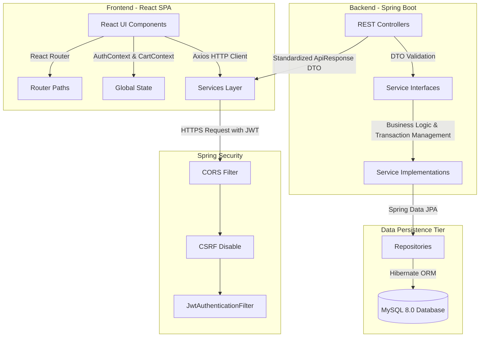
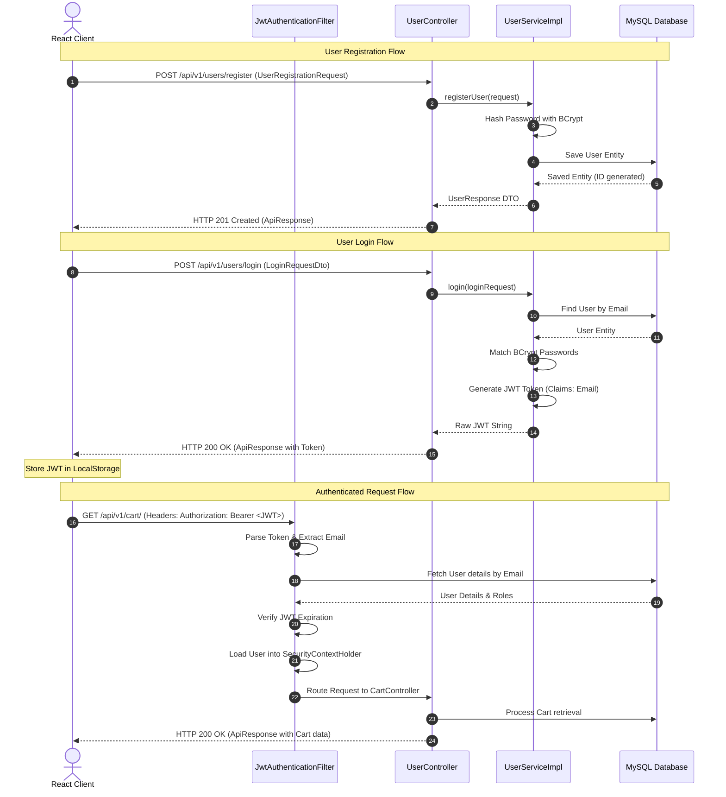

# 🍕 SwiftServe: A Stateful End-to-End Food Delivery Platform
### **Final Semester Software Engineering Capstone Project Report**
**System Architecture, Database Schema, and RESTful API Documentation**

---

## 🌟 Executive Summary & Abstract
**SwiftServe** is a high-performance, stateless, and secure full-stack food delivery application designed to serve as a high-throughput channel connecting three primary stakeholders: **Customers**, **Restaurant Owners**, and **System Administrators**. 

The system's core architecture features a decoupled client-server blueprint. The **Backend** is built as a state-of-the-art web API leveraging **Java 21** and **Spring Boot 3.x** along with **Spring Security 6** and **JWT (JSON Web Tokens)** for cryptographically secure stateless session management. The data storage tier relies on **MySQL 8.0** coupled with **Spring Data JPA** for robust object-relational mapping (ORM) and transaction consistency. The **Frontend** consists of a responsive single-page application (SPA) implemented using **React 19**, **Vite**, **React Router 7**, and **Axios** for high-efficiency, promise-based HTTP operations.

Key software engineering design patterns applied include the **Data Transfer Object (DTO)** pattern, **Inversion of Control (IoC) / Dependency Injection (DI)**, **Repository Pattern**, **Controller Advice** (Global Exception Handling), and **Chain of Responsibility** (Security Filters).

---

## 🏗️ 1. System Architecture & Design Patterns

SwiftServe operates on a strictly decoupled **Multi-Tiered Architectural Pattern** ensuring modularity, high testability, and clean separation of concerns.



### Architectural Layer Breakdown
1. **Presentation Layer (React Single Page Application):** Responsible for UI rendering, routing state, client-side session storage (JWT), and API aggregation using Axios services.
2. **Security Gateway Layer (Spring Security 6 & JWT):** Custom filter chain intercepts every request. Public endpoints (such as register, login, and restaurant searches) bypass checks, while protected endpoints require valid JWT headers.
3. **Controller Layer (REST Endpoints):** Receives HTTP request payloads, validates schemas using `@Valid` annotations, and maps incoming requests into Java DTO objects.
4. **Service Layer (Core Business Domain Logic):** Performs business validations (such as validating cart calculations and checking owner privileges) and handles multi-record ACID transactions.
5. **Data Access Layer (JPA Repositories):** Abstracts raw SQL operations using Hibernate ORM to interact with the relational model.

---

## 🔒 2. Stateless Security & JWT Authentication Flow

SwiftServe uses **JSON Web Tokens (JWT)** to ensure highly scalable, sessionless security. The authorization scheme relies on a **Security Filter Chain** executing a custom `OncePerRequestFilter`.



---

## 🗄️ 3. Database Schema & Entity Relationship (ER) Model

The database tier is designed in **Third Normal Form (3NF)** to avoid data redundancy and ensure relational integrity.

### 3.1 Entity Relationship Diagram (ERD)

```mermaid
erDiagram
    USER ||--o{ RESTAURANT : "owns"
    USER ||--o{ ORDER : "places"
    USER ||--oE CART : "has_one"
    USER ||--o{ REVIEW : "writes"
    USER }o--o{ RESTAURANT : "user_favorites (ManyToMany)"

    RESTAURANT ||--o{ MENU_ITEM : "contains"
    RESTAURANT ||--o{ ORDER : "receives"
    RESTAURANT ||--o{ REVIEW : "has"

    MENU_ITEM ||--o{ CART_ITEM : "added_to"
    MENU_ITEM ||--o{ ORDER_ITEM : "belongs_to"

    CART ||--o{ CART_ITEM : "holds"
    ORDER ||--o{ ORDER_ITEM : "comprises"
```

---

### 3.2 Data Dictionary (Table Schemas)

#### Table 1: `user`
Represents platform members including customers, restaurant owners, drivers, and administrators.
| Column Name | Data Type | Constraints | Description |
| :--- | :--- | :--- | :--- |
| `id` | `BIGINT` | `PRIMARY KEY`, `AUTO_INCREMENT` | Unique identifier for each user. |
| `email` | `VARCHAR(255)` | `UNIQUE`, `NOT NULL` | User registration email (login credential). |
| `name` | `VARCHAR(255)` | `NULL` | Full name of the user. |
| `password` | `VARCHAR(255)` | `NOT NULL` | Cryptographically salted BCrypt password hash. |
| `user_role` | `VARCHAR(50)` | `NOT NULL` | Enum: `CUSTOMER`, `RESTAURANT_OWNER`, `DRIVER`, `ADMIN`. |

#### Table 2: `restaurant`
Contains details of the dining establishments registered on the platform.
| Column Name | Data Type | Constraints | Description |
| :--- | :--- | :--- | :--- |
| `rest_id` | `BIGINT` | `PRIMARY KEY`, `AUTO_INCREMENT` | Unique identifier for the restaurant. |
| `name` | `VARCHAR(255)` | `NOT NULL` | Legal name of the restaurant. |
| `address` | `VARCHAR(255)` | `NOT NULL` | Physical address. |
| `contact_number`| `VARCHAR(50)` | `NULL` | Customer service contact number. |
| `description` | `VARCHAR(255)` | `NULL` | Blurb detailing restaurant specialties. |
| `image_url` | `VARCHAR(255)` | `NULL` | URL of the brand logo or showcase image. |
| `cuisine` | `VARCHAR(255)` | `NULL` | Category (e.g., Italian, Chinese, Indian). |
| `rating` | `DOUBLE` | `DEFAULT 0.0` | Cached running average of reviews rating. |
| `owner_id` | `BIGINT` | `FOREIGN KEY` references `user(id)` | Identifies the restaurant owner. |
| `is_open` | `BOOLEAN` | `DEFAULT TRUE` | Toggle for online ordering availability. |

#### Table 3: `menu_item`
Dishes available under specific restaurant profiles.
| Column Name | Data Type | Constraints | Description |
| :--- | :--- | :--- | :--- |
| `id` | `BIGINT` | `PRIMARY KEY`, `AUTO_INCREMENT` | Unique identifier for the menu item. |
| `name` | `VARCHAR(255)` | `NOT NULL` | Display name of the dish. |
| `description` | `VARCHAR(255)` | `NULL` | Ingredients or notes regarding the dish. |
| `category` | `VARCHAR(255)` | `NULL` | Menu sections (e.g., Appetizers, Main Course, Drinks). |
| `price` | `DECIMAL(38,2)`| `NOT NULL` | Exact cost of the item. |
| `image_url` | `VARCHAR(255)` | `NULL` | Link to the dish image. |
| `is_veg` | `BOOLEAN` | `DEFAULT FALSE` | Diet categorization. |
| `is_available` | `BOOLEAN` | `DEFAULT TRUE` | In-stock/out-of-stock toggle. |
| `rest_id` | `BIGINT` | `FOREIGN KEY` references `restaurant(rest_id)` | Restaurant offering this item. |
| `created_at` | `DATETIME` | `NULL` | Generation timestamp. |

#### Table 4: `cart`
Active transient order container mapped 1:1 to a Customer.
| Column Name | Data Type | Constraints | Description |
| :--- | :--- | :--- | :--- |
| `id` | `BIGINT` | `PRIMARY KEY`, `AUTO_INCREMENT` | Unique cart identifier. |
| `user_id` | `BIGINT` | `FOREIGN KEY` references `user(id)`, `UNIQUE` | Belongs to a unique customer. |
| `total_amount` | `DOUBLE` | `DEFAULT 0.0` | Cached cumulative total cost. |

#### Table 5: `cart_item`
Granular line items residing inside user carts.
| Column Name | Data Type | Constraints | Description |
| :--- | :--- | :--- | :--- |
| `id` | `BIGINT` | `PRIMARY KEY`, `AUTO_INCREMENT` | Unique cart item record identifier. |
| `cart_id` | `BIGINT` | `FOREIGN KEY` references `cart(id)` | Parent cart. |
| `menu_item_id` | `BIGINT` | `FOREIGN KEY` references `menu_item(id)`| The selected menu item. |
| `quantity` | `INTEGER` | `NOT NULL` | Count ordered. |
| `total_price` | `DOUBLE` | `NOT NULL` | `price * quantity` calculation. |

#### Table 6: `orders`
Immutable record of transaction placements.
| Column Name | Data Type | Constraints | Description |
| :--- | :--- | :--- | :--- |
| `id` | `BIGINT` | `PRIMARY KEY`, `AUTO_INCREMENT` | Unique order tracking number. |
| `customer_id` | `BIGINT` | `FOREIGN KEY` references `user(id)` | Customer placing the order. |
| `restaurant_id`| `BIGINT` | `FOREIGN KEY` references `restaurant(rest_id)`| Source restaurant. |
| `driver_id` | `BIGINT` | `FOREIGN KEY` references `user(id)`, `NULL` | Assigned driver (if any). |
| `delivery_address`| `VARCHAR(255)`| `NOT NULL` | Physical drop location. |
| `total_amount` | `DOUBLE` | `NOT NULL` | Total checked out price. |
| `status` | `VARCHAR(50)` | `NOT NULL` | Enum: `PENDING`, `PREPARING`, `OUT_FOR_DELIVERY`, `DELIVERED`, `CANCELLED`. |
| `payment_status`| `VARCHAR(50)` | `NOT NULL`, `DEFAULT 'PENDING'` | Enum: `PENDING`, `PAID`, `FAILED`, `REFUNDED`. |
| `payment_method`| `VARCHAR(50)` | `NULL` | E.g., `COD`, `CARD`, `UPI`. |
| `created_at` | `DATETIME` | `NOT NULL` | Timestamp of checkout transaction. |

#### Table 7: `order_item`
Detailed snapshot line items preserved for transaction records.
| Column Name | Data Type | Constraints | Description |
| :--- | :--- | :--- | :--- |
| `id` | `BIGINT` | `PRIMARY KEY`, `AUTO_INCREMENT` | Unique order item record identifier. |
| `order_id` | `BIGINT` | `FOREIGN KEY` references `orders(id)` | Parent order record. |
| `menu_item_id` | `BIGINT` | `FOREIGN KEY` references `menu_item(id)`| Reference to original product. |
| `quantity` | `INTEGER` | `NOT NULL` | Amount purchased. |
| `total_price` | `DOUBLE` | `NOT NULL` | Preserved historic price snapshot. |

#### Table 8: `review`
Customer ratings and commentary regarding specific restaurants.
| Column Name | Data Type | Constraints | Description |
| :--- | :--- | :--- | :--- |
| `id` | `BIGINT` | `PRIMARY KEY`, `AUTO_INCREMENT` | Unique review identifier. |
| `comment` | `VARCHAR(255)` | `NULL` | Textual review. |
| `rating` | `INTEGER` | `NOT NULL` | Score ranging from `1` to `5`. |
| `customer_id` | `BIGINT` | `FOREIGN KEY` references `user(id)` | Author of review. |
| `restaurant_id`| `BIGINT` | `FOREIGN KEY` references `restaurant(rest_id)`| Target restaurant. |
| `created_at` | `DATETIME` | `NOT NULL` | Review submission timestamp. |

---

## 📡 4. RESTful API Endpoints & Payload Specifications

The platform is designed around strict **RESTful APIs** communicating over JSON under path version `/api/v1/`.

### 4.1 User Authentication Module (`/api/v1/users`)
* **`POST /register`**
  * **Description:** Register a new account.
  * **Payload Request:**
    ```json
    {
      "email": "customer@gmail.com",
      "name": "Jane Doe",
      "password": "securepassword123",
      "userRole": "CUSTOMER"
    }
    ```
  * **Response:** (201 Created)
    ```json
    {
      "success": true,
      "message": "User Registerd Successfully",
      "data": {
        "id": 1,
        "name": "Jane Doe",
        "email": "customer@gmail.com",
        "userRole": "CUSTOMER"
      }
    }
    ```
* **`POST /login`**
  * **Description:** Access portal using credentials. Returns raw JWT bearer token.
  * **Payload Request:**
    ```json
    {
      "email": "customer@gmail.com",
      "password": "securepassword123"
    }
    ```
  * **Response:** (200 OK)
    ```json
    {
      "success": true,
      "message": "Login Successfull",
      "data": "eyJhbGciOiJIUzI1NiJ9.eyJzdWIiOiJjdXN0b21lckBnbWFpbC5jb20iLCJpYXQiOjE3MTY1Nj..."
    }
    ```
* **`GET /me`**
  * **Description:** Fetches active token profile data. Requires `Authorization: Bearer <JWT>`.

---

### 4.2 Restaurant & Menu Module (`/api/v1/restaurants` & `/api/v1/Menu`)
* **`GET /api/v1/restaurants/search`**
  * **Description:** Returns paginated, filtered results of active restaurants.
  * **Parameters:** `keyword` (String), `cuisine` (String), `rating` (Double), `page` (default 0), `size` (default 10).
* **`POST /api/v1/restaurants/add`**
  * **Description:** Create restaurant profile. Requires `RESTAURANT_OWNER` or `ADMIN` token.
  * **Payload Request:**
    ```json
    {
      "name": "Pizza Planet",
      "address": "456 Orbit Ave",
      "contactNumber": "9876543210",
      "description": "Out of this world pies!",
      "imageUrl": "http://image-repo/pizzaplanet.png",
      "cuisine": "Italian"
    }
    ```
* **`POST /api/v1/Menu/add`**
  * **Description:** Adds dish to active menu.
  * **Payload Request:**
    ```json
    {
      "name": "Pepperoni Feast",
      "description": "Double pepperoni with extra mozzarella",
      "category": "Main Course",
      "price": 14.99,
      "imageUrl": "http://images/pep.png",
      "isVeg": false,
      "restaurantId": 1
    }
    ```

---

### 4.3 Shopping Cart Module (`/api/v1/cart`)
*Requires valid user session (`CUSTOMER` / `RESTAURANT_OWNER` JWT).*
* **`GET /`**
  * **Description:** Fetches user's current shopping cart and total amount.
* **`POST /add-item`**
  * **Description:** Inserts dish into cart.
  * **Payload Request:**
    ```json
    {
      "menuItemId": 1,
      "quantity": 2
    }
    ```
* **`PUT /update-quantity`**
  * **Description:** Increment/decrement count.
  * **Payload Request:**
    ```json
    {
      "cartItemId": 1,
      "quantity": 5
    }
    ```

---

### 4.4 Order Management Module (`/api/v1/orders`)
*Requires valid session.*
* **`POST /checkout`**
  * **Description:** Converts cart into immutable active Order.
  * **Payload Request:**
    ```json
    {
      "deliveryAddress": "123 Main St, Apt 4B",
      "paymentMethod": "CARD"
    }
    ```
  * **Response:** (201 Created)
    ```json
    {
      "success": true,
      "message": "Order placed successfully",
      "data": {
        "id": 1,
        "customerName": "Jane Doe",
        "restaurantName": "Pizza Planet",
        "totalAmount": 29.98,
        "status": "PENDING",
        "createdAt": "2026-05-25T09:25:00"
      }
    }
    ```
* **`PUT /{orderId}/status`**
  * **Description:** Modifies status of preparing or incoming order. Requires `RESTAURANT_OWNER` or `ADMIN` token.
  * **Parameters:** `status` (E.g. `PREPARING`, `OUT_FOR_DELIVERY`, `DELIVERED`, `CANCELLED`).

---

## 💻 5. Frontend Client-Side Architecture (React + Vite)

The frontend is a lightweight **React Single-Page Application (SPA)** that consumes the RESTful APIs using standard async/await paradigms.

```
Frontend/src/
├── main.jsx                 # Application bootstrapping entrypoint
├── App.jsx                  # Main router controller and contexts provider
├── index.css                # Global styles and customized variables
├── context/
│   ├── AuthContext.jsx      # Global user login state, JWT validation, & hooks
│   └── CartContext.jsx      # Shared shopping cart state across screens
├── services/
│   ├── api.js               # Central Axios configuration with JWT interceptor
│   ├── authService.js       # Core backend auth calls (register, login, me)
│   ├── restaurantService.js # Fetching and updating restaurant lists
│   └── orderService.js      # Checkout and history processing
└── pages/
    ├── Home.jsx             # Splash, search portal & initial landing page
    ├── Login.jsx            # User sign-in interface
    ├── Register.jsx         # User registration form
    ├── Restaurants.jsx      # Main browser with filtering and favorites
    ├── RestaurantDetails.jsx# Menu inspection and adding to cart
    ├── Cart.jsx             # Active items review and checkout details
    ├── Orders.jsx           # Order tracking and customer history
    ├── OwnerDashboard.jsx   # Business portal (menu / order management)
    └── AdminDashboard.jsx   # System portal (user / shop control lists)
```

### 5.1 Central Axios Interceptor (`services/api.js`)
To prevent manually appending security tokens to each HTTP request, Axios is configured with an authorization interceptor:
```javascript
import axios from 'axios';

const api = axios.create({
  baseURL: 'http://localhost:8080/api/v1',
  headers: {
    'Content-Type': 'application/json',
  },
});

// Auto-inject JWT into headers
api.interceptors.request.use((config) => {
  const token = localStorage.getItem('token');
  if (token) {
    config.headers.Authorization = `Bearer ${token}`;
  }
  return config;
}, (error) => {
  return Promise.reject(error);
});

export default api;
```

---

## 🛡️ 6. Core Implementation Highlights (Backend)

### 6.1 Security Configurations (`SecurityConfig.java`)
Spring Security's filter chain is stateless and defines granular access levels matching the role permissions:
```java
@Bean
SecurityFilterChain securityFilterChain(HttpSecurity httpSecurity) throws Exception {
    httpSecurity
        .cors(cors -> cors.configurationSource(corsConfigurationSource()))
        .csrf(AbstractHttpConfigurer::disable)
        .authorizeHttpRequests(auth -> auth
            // Public Endpoints
            .requestMatchers(
                "/api/v1/users/register", 
                "/api/v1/users/login",
                "/api/v1/restaurants/search",
                "/api/v1/restaurants/get/**"
            ).permitAll()
            // Swagger Documentation Endpoints
            .requestMatchers(
                "/v3/api-docs/**",
                "/swagger-ui/**",
                "/swagger-ui.html"
            ).permitAll()
            // Admin Protected Zone
            .requestMatchers("/api/v1/admin/**").hasRole("ADMIN")
            // Protected customer / owner endpoints
            .anyRequest().authenticated()
        )
        .sessionManagement(session -> session.sessionCreationPolicy(SessionCreationPolicy.STATELESS))
        .addFilterBefore(jwtAuthenticationFilter, UsernamePasswordAuthenticationFilter.class);

    return httpSecurity.build();
}
```

### 6.2 Global Exception Handler (`GlobalExceptionHandler.java`)
Centralized exception management intercepts system failures and converts them into standardized JSON DTO payloads for cleaner client handling:
```java
@RestControllerAdvice
public class GlobalExceptionHandler {

    @ExceptionHandler(ResourceNotFoundException.class)
    public ResponseEntity<ApiResponse<String>> handleNotFound(ResourceNotFoundException ex) {
        return ResponseEntity
            .status(HttpStatus.NOT_FOUND)
            .body(new ApiResponse<>(false, ex.getMessage(), null));
    }

    @ExceptionHandler(UnauthorizedException.class)
    public ResponseEntity<ApiResponse<String>> handleUnauthorized(UnauthorizedException ex) {
        return ResponseEntity
            .status(HttpStatus.UNAUTHORIZED)
            .body(new ApiResponse<>(false, ex.getMessage(), null));
    }

    @ExceptionHandler(MethodArgumentNotValidException.class)
    public ResponseEntity<ApiResponse<String>> handleValidationErrors(MethodArgumentNotValidException ex) {
        String errorMsg = ex.getBindingResult().getFieldErrors().stream()
            .map(error -> error.getField() + ": " + error.getDefaultMessage())
            .collect(Collectors.joining(", "));
        return ResponseEntity
            .status(HttpStatus.BAD_REQUEST)
            .body(new ApiResponse<>(false, "Validation Failed: " + errorMsg, null));
    }
}
```

---

## 📈 7. Testing & Quality Assurance

To ensure the robustness of the SwiftServe system, rigorous software engineering verification workflows were applied:

1. **Integration Testing:** Endpoint-to-database integration verified with Spring Boot's `@SpringBootTest` alongside transactional state rollback mechanisms to maintain clean databases after testing.
2. **Security Integrity Validation:** Confirmed that endpoints requiring specific roles (like `/api/v1/admin/*` or `/api/v1/Menu/add`) return an `HTTP 403 Forbidden` response when requested with invalid credentials or incorrect roles.
3. **Frontend API Mocking & Validation:** Used Chrome DevTools Network Tab and Axios interceptors to trace payload formatting and verify token storage integrity inside browser `localStorage`.
4. **Input Constraints Validation:** Tested Spring validation bounds (such as matching email syntax, password limits, and empty field checks on registration) to block invalid requests at the gateway.

---

## 🔮 8. Conclusion & Future Recommendations

The **SwiftServe** platform successfully demonstrates a highly scalable, enterprise-grade architecture for an online food delivery service. By keeping backend states stored within the relational MySQL tier, the server layer can be horizontally scaled using standard load balancers.

### Future Roadmap & Enhancements
1. **Real-time Notifications:** Integrate **WebSockets** or Server-Sent Events (SSE) to send real-time order status updates (e.g. "Preparing", "Out for Delivery") to customers.
2. **Caching Layer:** Use a **Redis** cache for hot static data (like restaurant lists and menus) to reduce DB query times and MySQL CPU load.
3. **Containerization (Docker):** Standardize deployment by containerizing both the Spring Boot app and MySQL server into a unified `docker-compose` stack.
4. **Payment Gateway Integration:** Incorporate sandbox payment models like Stripe or Razorpay to transition from mock payment methods to secure payment channels.
